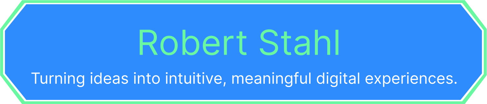

# 👋 Hi, I'm Robert Stahl

🎮 **Game Developer & Software Engineer**  
💻 Unity (C#) | ServiceNow Development | Full-Stack Skills  
📍 Based in the U.S. | Open to remote & hybrid roles

---

## 🚀 Featured Projects

### [Cube Conquest](https://github.com/robertstahldev/CubeConquest)
Turn-based 3D strategy game with AI, hover animations, and a battle minigame.

**Demo:**

    
    
  

   
  
  

**Highlights:**
- AI pathfinding & strategic decision-making  
- Animated hover effects with Unity Animators  
- Separate battlefield mode with its own tile logic

---

### [Other Projects](#)
Duty Beyond (ServiceNow / App Engine Studio)
Custom ServiceNow application built to manage community event volunteers and coordinators. Designed a modal-based slot selection system using UI Builder, dynamic data filtering, and role-based access controls. Improved event assignment speed and reduced duplicate signups.

Traffic Simulation (Java / JavaFX)
A multi-threaded visual simulation of traffic lights and cars, complete with pause/resume, adjustable timing, and animated movement. Demonstrates concurrency handling, event-driven UI design, and clean separation of logic for scalability.

Expression Tree Evaluator (C++ / Flex / Bison)
A compiler project implementing parsing and evaluation of arithmetic and logical expressions, supporting binary, unary, ternary, and quaternary operators. Built using an abstract syntax tree (AST) with robust error handling and operator precedence.

Deployment Management Tracker (SharePoint / VBA / JSON)
Developed an interactive SharePoint tracker for a military deployment program. Used JSON for automated calculations, conditional formatting, and real-time readiness reporting. Reduced overdue training from 27% to 2% within months.

---

### 🛠 Tech Stack

  

---

### 🏆 Notable Skills
- **Game Development:** Unity (2D & 3D), C#, AI Pathfinding, Physics-based Mechanics, UI/UX for Games  
- **Software Engineering:** Java, C++, Python, Git, Agile/Scrum, API Integration  
- **Specialties:** Gameplay Systems, Turn-based Strategy, Procedural Level Design, Performance Optimization  
- **Tools:** Visual Studio, Rider, Blender, Photoshop, GitHub, ServiceNow UI Builder  
- **Other Strengths:** Cross-functional Collaboration, Technical Documentation, Debugging Complex Systems

---

## 📫 Let's Connect

- **LinkedIn:** [www.linkedin.com/in/rob-stahl](#)  
- **GitHub:** [github.com/robertstahldev](https://github.com/robertstahldev)

## 📫 Connect

